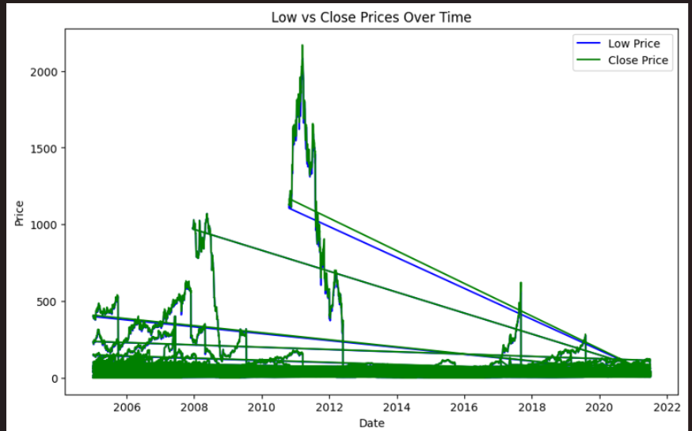
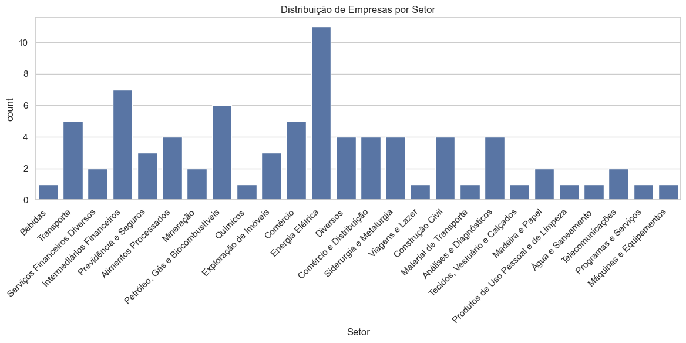

# Análise Financeira: Consultoria de Investimentos 📊💰

## Descrição do Projeto

Este projeto visa realizar uma análise detalhada do Índice Bovespa, ajudando investidores a tomar decisões informadas sobre quais ações investir. Utilizamos técnicas de análise exploratória de dados e visualizações em Tableau para apresentar os resultados de forma clara e intuitiva. 📈

## Objetivos 🎯

* Analisar e interpretar dados financeiros de empresas listadas no Índice Bovespa.
* Identificar padrões e tendências nos dados de ações.
* Fornecer recomendações de investimento com base nas análises realizadas.

## Tecnologias Utilizadas 🛠️

* **Python** : Para manipulação e análise de dados.
* **Pandas** : Biblioteca para análise de dados.
* **Matplotlib** : Biblioteca para visualização de dados.
* **Seaborn** : Biblioteca para visualização estatística baseada em Matplotlib.
* **Jupyter Notebook** : Ambiente para desenvolvimento interativo.
* **Tableau** : Ferramenta de visualização de dados.

# Estrutura do Projeto 📁

Análise_Financeira/
│
├── dados/
│   ├── Informações_e_Indicadores_por_Empresa.xlsx
│   └── Cotações_diárias_por_Empresa.xlsx
│
├── notebooks/
│   └── analise_financeira.ipynb
│
└── visualizacoes/
    └── analise_visualizacao.tableau

## Como Executar o Projeto 🚀

1. **Clone o repositório** :

git clone <URL_do_repositório>
cd Análise_Financeira

2. **Instale as dependências** :
   Certifique-se de ter o Python e as bibliotecas necessárias instaladas. Você pode usar `pip` para instalar as dependências:

   pip install pandas matplotlib seaborn openpyxl
4. **Execute o Jupyter Notebook** :

   jupyter notebook notebooks/analise_financeira.ipynb

 **Visualize os gráficos** :

Após executar as células do Jupyter Notebook, você verá os gráficos gerados a partir da análise. Você também pode abrir o arquivo `.tableau` no Tableau para explorar as visualizações.

##

## Análise Realizada 🔍

### 1. Importação e Limpeza de Dados

* Os dados foram carregados a partir de arquivos Excel.
* Verificamos a presença de valores nulos e realizamos a limpeza necessária.

### 2. Análise Exploratória

* **Descrição das colunas numéricas** : Foram analisadas as principais métricas financeiras como Cotação, PL (Preço sobre Lucro), Dividend Yield, entre outros.
* **Gráficos de Tendência** : Gráficos de linha e dispersão foram utilizados para visualizar a evolução dos preços das ações e a correlação entre diferentes indicadores financeiros.

### 3. Resultados e Conclusões

* Os gráficos mostram a volatilidade dos ativos e a distribuição de empresas entre os setores.
* A análise indicou que setores como "Energia Elétrica" apresentam maior consistência em desempenho financeiro, enquanto setores como "Bebidas" demonstraram maior volatilidade.

## Recomendações 💡

* **Diversificação** : Invista em diferentes setores para reduzir riscos.
* **Foco em Setores Lucrativos** : Concentre-se em setores com altos ROIC (Retorno sobre Capital Investido), ROE (Retorno sobre Patrimônio Líquido) e margens líquidas.
* **Análise de Tendências** : Examine o histórico de desempenho para identificar setores com crescimento consistente.

## Dashboard Interativo 📊

Explore o dashboard interativo que criei no Tableau, onde você pode visualizar a análise em detalhes:

👉 [Análise Mercado Financeiro](https://public.tableau.com/app/profile/patricia.oliveira8640/viz/AnliseMercadoFinanceiro/AnliseIndividual)

## Contribuições 🤝

Contribuições são bem-vindas! Se você quiser melhorar o projeto ou adicionar novas funcionalidades, sinta-se à vontade para abrir uma issue ou pull request.

## Licença 📜

Este projeto está licenciado sob a [MIT License]().

## Contato 📧

Para mais informações, entre em contato:

* **Nome** : Patrícia Oliveira
* **E-mail** : patriciasavarezioliveira@gmail.com
* **LinkedIn** : [Patrícia Oliveira](https://www.linkedin.com/in/patyoliver)
